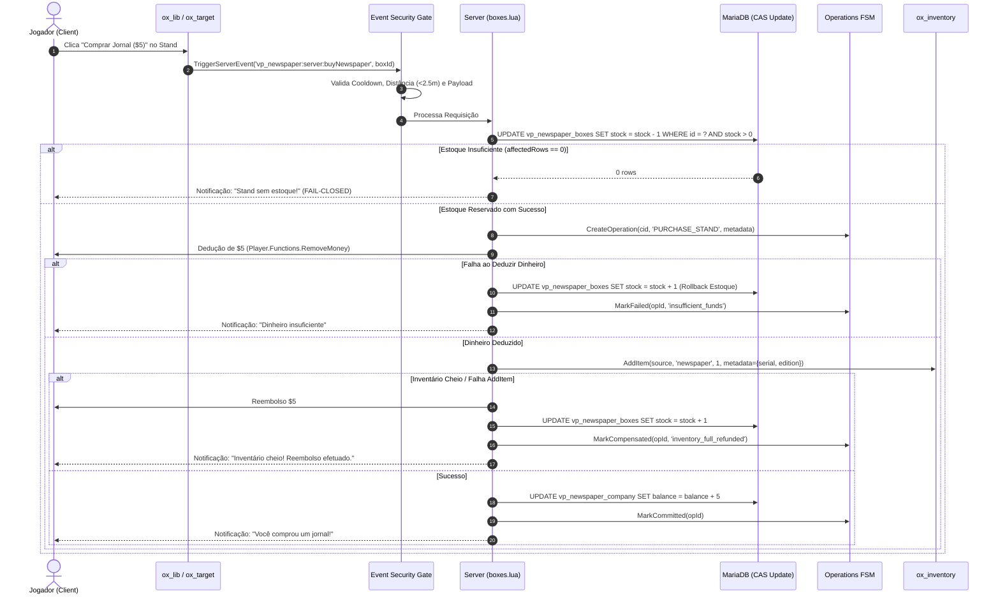
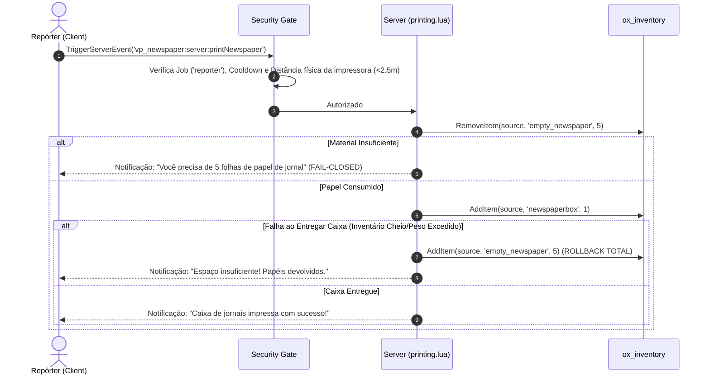
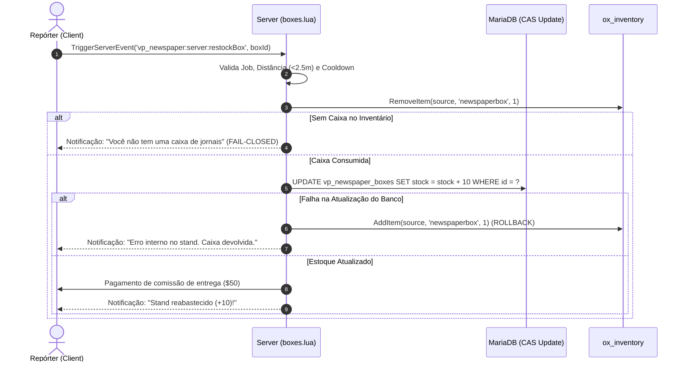
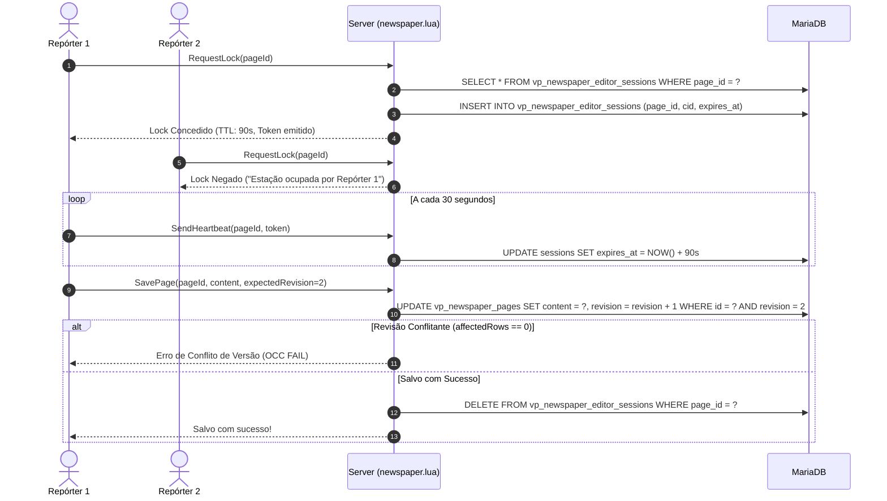
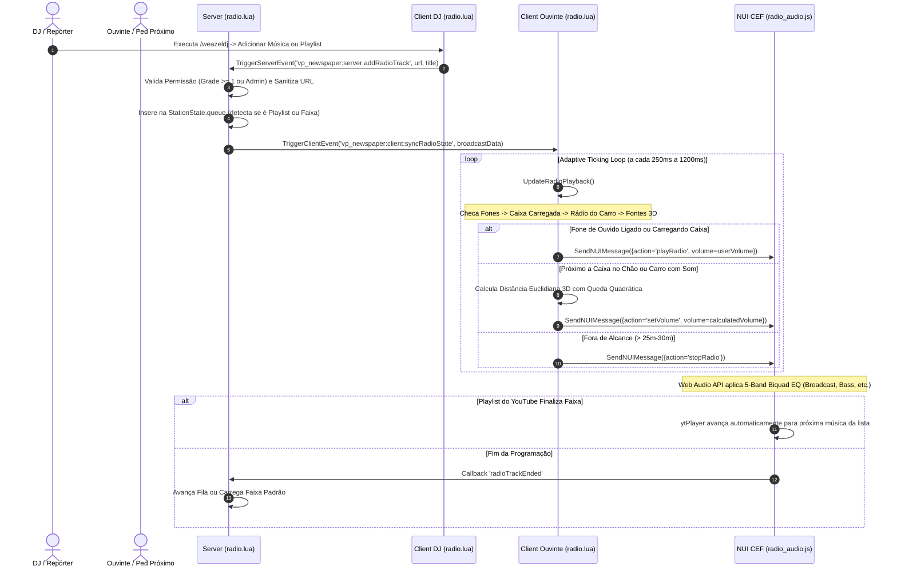

# Arquitetura do Sistema — `vp_newspaper`

## 1. Visão Geral e Stack Tecnológica
O `vp_newspaper` é um resource FiveM de jornalismo impresso e distribuição física de notícias construído para Heavy RP, alta concorrência e integridade transacional absoluta.

### Stack de Dependências
* **FiveM FXServer:** Artifacts recomendados 10000+ (OneSync Infinity ativado).
* **Ambiente de Execução:** Lua 5.4 nativo com isolamento rigoroso de escopo (`local` obrigatório).
* **Framework:** Qbox / QBCore (`exports['qbx_core']` e compatibilidade `QBCore.Functions`).
* **Utilitários e UI:** `ox_lib` (points, callbacks, notifications, progressBar, cache, context menus, input dialogs).
* **Interação Física:** `ox_target` (interações nos modelos de stands de jornal, pontos de impressão, editor, cofre, veículos e caixas de som no chão).
* **Inventário:** `ox_inventory` (manipulação atômica de slots, metadata de seriais únicos e persistência de itens).
* **Persistência Relacional:** `oxmysql` (MariaDB/MySQL) com transações ACID, versionamento otimista e constraints rígidas.
* **Frontend & Áudio CEF:** NUI (HTML5, Vanilla JS, Web Audio API com 5-band Biquad Equalizer, YouTube IFrame API com suporte nativo a Playlists).
* **Sincronização 3D:** StateBags replicadas (`weazelVehicleSpeaker`, `weazelCarryingRadio`) e registro server-side de alto-falantes (`ActiveGroundSpeakers`).

---

## 2. Ciclo de Vida do Resource (Lifecycle)

```
[Server Boot / Resource Start]
       │
       ▼
1. Execução de Migrations SQL Idempotentes (001 -> 002 -> 003 -> 004 -> 005)
       │
       ▼
2. FSM Crash Recovery (RecoverOnBoot: reconcilia operações 'PROCESSING' / 'PENDING')
       │
       ▼
3. Limpeza de Locks Órfãos de Editor Sessions
       │
       ▼
4. Carga de Cache Inicial em Memória (Stands/Boxes a partir do Banco de Dados)
       │
       ▼
[Execução em Runtime (Event-Driven & State Machine)]
       │
       ├── Interações via ox_target (Client)
       ├── Validações de Distância Física, Cooldowns e Payload (Security Module)
       ├── Transações Atômicas CAS no Banco e Ledgering Financeiro
       │
[Player Dropped]
       │
       ▼
5. Liberação imediata de lock de editor para a CID desconectada
       │
[Resource Stop]
       │
       ▼
6. Cleanup de ox_lib points e desvinculação graciosa de sessões ativas
```

---

## 3. Diagramas de Sequência

### 3.1. Compra de Jornal no Stand (Atômica & Anti-Dupe)


---

### 3.2. Impressão de Jornais na Gráfica


---

### 3.3. Reposição de Stand (Restock)


---

### 3.4. Edição Concorrente com Lock e OCC (Optimistic Concurrency Control)


---

### 3.5. Transmissão da Weazel Radio 98.5 FM, Som 3D & Playlists


