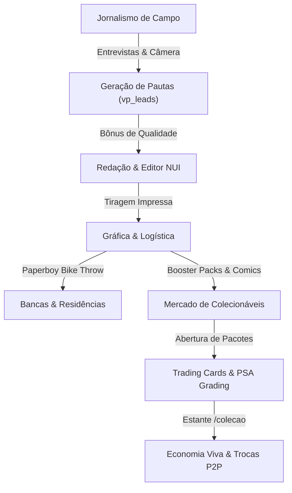

# 🎮 Análise de Lacunas de Jogabilidade (GAMEPLAY_GAP_ANALYSIS)

Este documento avalia a experiência do jogador (Player Experience, RP Loops e Progressão) no `vp_newspaper` em comparação com os scripts de referência do ecossistema.

Data da Análise: 25/09/2026  
Status: Lacunas Identificadas & Mapeadas  

---

## 1. Mapeamento de Loops de Gameplay

### 1.1 O Ciclo Tradicional do `vp_newspaper`
1. Jornalista digita matéria no editor NUI -> Publica.
2. Gráfica imprime tiragem de jornais.
3. Entregador pega van da empresa e abastece bancas de rua.
4. Cidadão vai até a banca e compra jornal para ler.
5. Equipe de rádio transmite faixas na rádio 98.5 FM.

**Problemas Identificados no Ciclo Antigo:**
- **Falta de atividade de rua para o jornalista:** O repórter ficava restrito a sentar na cadeira e digitar texto, sem incentivo para explorar o mapa em busca de notícias.
- **Falta de retenção e colecionismo para cidadãos comuns:** O jornal é consumido uma vez e descartado; não havia itens colecionáveis duradouros.
- **Monotonia na entrega:** Entregas eram restritas à direção de uma van pesada, sem agilidade ou mecânicas de habilidade motora.

---

## 2. A Transformação com os Sistemas Absorvidos

### 2.1 Papéis de Roleplay Enriquecidos
- **O Investigador de Campo:** Utiliza microfone e câmera em áreas de conflito ou eventos públicos, gerando pautas tangíveis (`vp_leads`) que provam que ele esteve no local dos fatos.
- **O Entregador Paperboy:** Jogabilidade arcade e ágil pelas calçadas de Los Santos, arremessando jornais em alta velocidade de cima de bicicletas.
- **O Colecionador & Especulador:** Abre pacotes de cartas raras, avalia o estado das cartas na junta PSA em busca de notas 10 ("Gem Mint") e negocia suas relíquias com outros jogadores.
- **O Leitor de Quadrinhos:** Relaxa lendo quadrinhos e contos ilustrados através do visor de revistas.
