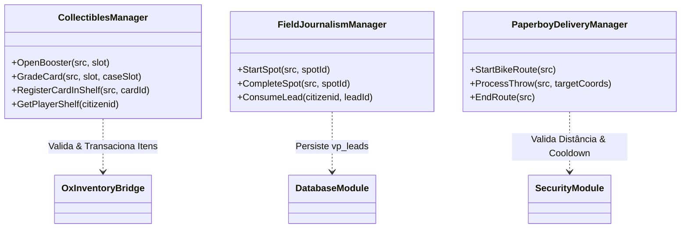

# ⚙️ Análise de Lacunas Técnicas, Segurança e Arquitetura (TECHNICAL_GAP_ANALYSIS)

Este documento avalia a solidez arquitetural, contratos cliente/servidor, segurança contra injeção e exploração e conformidade com o ecossistema QBox/ox.

Data da Análise: 25/09/2026  
Status: Auditoria Técnica Concluída  

---

## 1. Auditoria de Segurança nos Recursos de Referência

Ao estudar o código de referência (especialmente em `haze-newspaper` e outros scripts de mercado), identificamos riscos que **NÃO devem ser replicados** e como o `vp_newspaper` garantirá a segurança absoluta:

### 1.1 Risco 1: Manipulação de RNG de Sorteio de Cartas
- **Vulnerabilidade encontrada em scripts comuns (ex: mi-card):** O cliente decide a carta ou chama `AddItem` diretamente com o ID da carta desejada, permitindo que cheaters obtenham apenas cartas lendárias.
- **Solução no `vp_newspaper`:** O sorteio de raridade e seleção da carta ocorre **100% no servidor**, de forma opaca. O cliente apenas dispara `vp_newspaper:server:openBoosterPack` e recebe os itens calculados pelo backend após o débito garantido do pacote.

### 1.2 Risco 2: Forja de Subnotas no PSA Grading
- **Vulnerabilidade encontrada:** O cliente enviava a nota desejada para o servidor salvar no item.
- **Solução no `vp_newspaper`:** A avaliação do PSA é puramente estocástica server-side:
  - `subscores = { centering = rand(7,10), corners = rand(7,10), edges = rand(7,10), surface = rand(7,10) }`
  - `grade = math.floor((centering + corners + edges + surface) / 4)`
  - O número de série único é gerado no formato `PSA-XXXX-XXXX` utilizando hash criptográfico com sal temporal do servidor.

### 1.3 Risco 3: Spoofing de Arremesso Paperboy (Teleport Dupe / Fast Cash)
- **Vulnerabilidade potencial:** Cheater dispara centenas de eventos de entrega por segundo sem estar fisicamente no local.
- **Solução no `vp_newspaper`:**
  - Validação estrita de coordenadas: distância euclidiana máxima do jogador ao ponto de entrega `< 15.0m`.
  - Checagem de veículo: o jogador deve estar montado em uma bicicleta cadastrada (`GetVehiclePedIsIn`).
  - Rate limit e cota diária: cooldown de 3 segundos entre arremessos e limite máximo de entregas por dia/sessão.

### 1.4 Risco 4: Persistência de Pautas e Injeção SQL
- **Solução no `vp_newspaper`:** Uso exclusivo de queries parametrizadas com `oxmysql:execute` (`?`), garantindo sanitização integral contra qualquer injeção maliciosa.

---

## 2. Decisões Arquiteturais Fundamentais

1. **Separação de Domínios:** Módulos novos em arquivos próprios (`server/cards.lua`, `client/cards.lua`, `server/field.lua`, `client/field.lua`, `client/throw.lua`, `server/throw.lua`).
2. **Fail-Closed:** Se houver qualquer inconsistência ou falta de espaço no inventário, a transação aborta sem debitar dinheiro ou destruir itens.
3. **Compatibilidade QBox/ox:** Todas as chamadas de inventário usam estritamente `exports.ox_inventory`.
